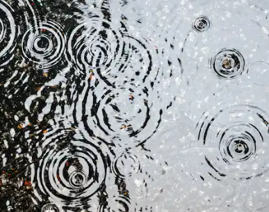

# Pluie
Imaginons qu’on veuille programmer le comportement d’un nuage qui
fait pleuvoir des gouttes d’eau...

## Conception
Plutôt que d’être coincé devant un écran, il est judicieux de réfléchir avec 
des outils qui ont fait leur preuve : papier + crayon

### Game Engine (moteur de jeu)
L’idée est de partir sur un moteur de jeu un peu différent de celui du Snail.
Le principe est le suivant :

1. On stocke une liste d’éléments à afficher avec leur coordonnée X et Y

2. Toutes les 100ms, on efface toute la console et on redessine les éléments dans leur 
position (nouvelle ou pas)

#### Implications
Ceci va impacter le choix des attributs et méthodes qui vont suivre...

### Noter sur un POSTIT différent le nom de chaque classe (en haut du postit)
1. Cloud
2. ...

### Pour chaque classe (POSTIT), identifier et noter les attributs
1. GameEngine
   2. cloud
   3. ...

2. Cloud
   2. skin
   7. ...

5. Drop
   9. speed
   10. ...

### Pour chaque classe (POSTIT), identifier et noter les méthodes
1. GameEngine
   2. Start()
   3. Quit()
   
2. Cloud
   1. MoveByTheWind()
   2. ...
   
3. Drop
   1. Fall()
   2. ...

## Réalisation
Créer un nouveau projet C# et commencer à transcrire les POSTITs en classes et code.

### GameEngine
La méthode *Start()* consistera en une boucle qui s’arrête lorsqu’on appuie sur la touche ESC
```text
faire
{
    Effacer l’écran
    
    Pour tous les nuages:
        Afficher le nuage
        SI nuage.MoveByTheWind() est FAUX :
            retirer le nuage de la liste
        SINON SI "nuage doit encore pleuvoir" :
            créer N nouvelles gouttes
            ...
            
    Pour toutes les gouttes:
        ...
    
    Attendre 100ms
    
}tant qu’on appuie pas sur la touche ESC
```

### Cloud
Pour pouvoir afficher un nuage avec le code suivant :
```csharp
Console.Write(cloud)
```

Grâce à la POO, on peut **remplacer** la méthode *ToString()* de la classe *Object*
de cette manière
```csharp
public override string ToString()
{
    return Convert.ToString(skin);
}
```

Ainsi, on peut passer les instances de type *Cloud* à la méthode *Write*...

### Drop
Quand on a réussi la classe *Cloud*, la classe *Drop* ne devrait avoir
aucun secret...

## Refactoring (avancé)
Sans avoir vu la théorie de l’héritage, comment pourrait-on mutualiser
le code commun de la goutte et du nuage (position, skin) dans une classe
qu’on pourrait, par exemple, appeler *Sprite*

### Identifier les éléments communs

### Créer la classe avec ces éléments

### Enlever le code similaire dans Cloud et Drop et ajouter ":Sprite" à la signature de classe...